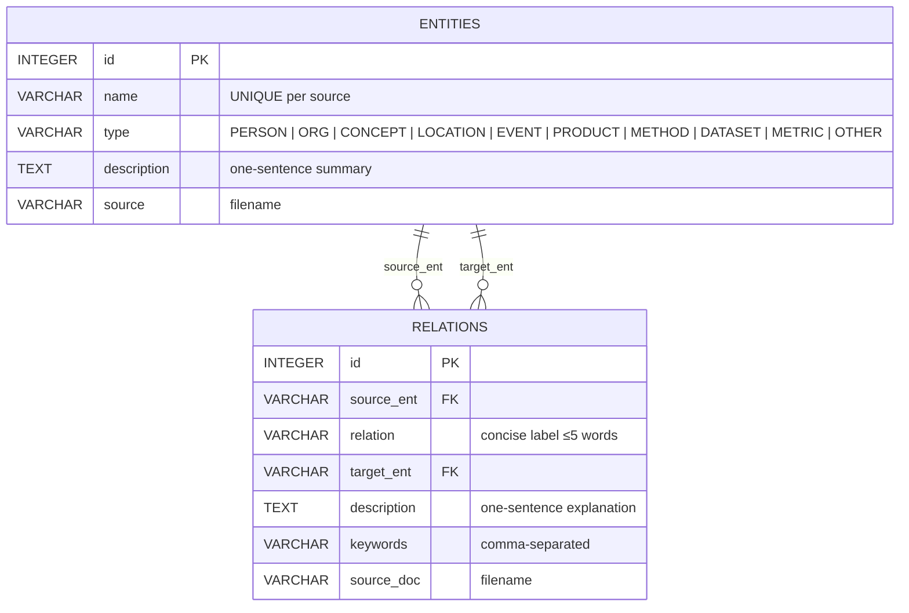
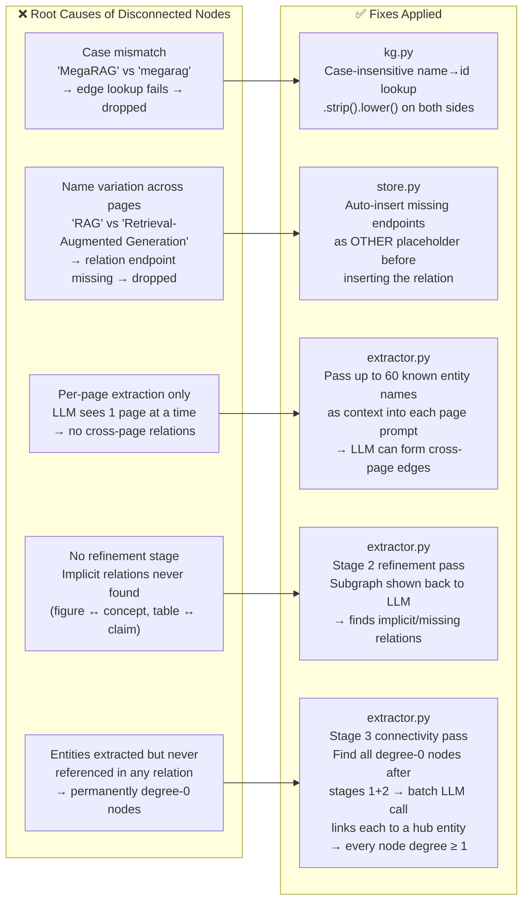

# MegaRAG — Knowledge Graph Construction Pipeline

## Full Architecture

```mermaid
flowchart TD
    subgraph INPUT["📄 Document Input"]
        PDF[PDF File]
        PDF --> DOCLING[Docling Parser]
        DOCLING -->|per-page markdown| PAGES["Pages\n[page_1, page_2, ..., page_n]"]
        DOCLING -->|page images| IMGS["Page Images\n(future: visual entities)"]
    end

    subgraph STAGE1["🔵 Stage 1 — Initial Extraction  (per page, sequential)"]
        direction TB
        P1["Page i markdown"]
        CTX["Cross-page context\n(entity names from pages 1..i-1\ncapped at 60 names)"]
        LLM1["LLM — llama3.1\n(Ollama / Azure OpenAI)"]
        OUT1["Raw output\n{ entities[], relations[] }"]

        P1 --> LLM1
        CTX --> LLM1
        LLM1 -->|JSON| OUT1
        OUT1 -->|dedup by name| DEDUP1["Deduplicate\n(name-only key\nnot name+type)"]
        DEDUP1 --> ACCUM["Accumulated G⁰\nentities + relations"]
        ACCUM -->|next page context| CTX
    end

    subgraph STAGE2["🟠 Stage 2 — Refinement  (MegaRAG §3.2)"]
        direction TB
        P2["Page i markdown"]
        EIDX["Entity Embedding Index\nColQwen embed_text_mean()\nname + description → vec(128)\nbuilt once after Stage 1"]
        SEM["Semantic Retrieval\npage_vec · entity_matrix\ncosine similarity top-30\n(falls back to global top-30\nif ColQwen unavailable)"]
        SUBG["Page-specific subgraph\n(semantically relevant entities\n+ top 20 relations)"]
        LLM2["LLM — llama3.1\n(same model, different prompt)"]
        OUT2["Missing knowledge\n{ new_entities[], new_relations[] }"]

        P2 -->|embed_text_mean| SEM
        EIDX --> SEM
        SEM --> SUBG
        P2 --> LLM2
        SUBG --> LLM2
        LLM2 -->|JSON| OUT2
        OUT2 -->|dedup + merge| REFINED["Refined Graph G¹\n(all entities + relations)"]
    end

    subgraph STAGE3["🟢 Stage 3 — Connectivity Pass  (custom)"]
        direction TB
        DEG["Compute node degree\nfor every entity"]
        ISO["Isolated nodes\n(degree = 0)"]
        HUBS["Hub entities\n(top-20 by degree)"]
        LLM3["LLM — llama3.1\nbatch of 15 isolated nodes\n+ hub list"]
        OUT3["Suggested edges\n1 relation per isolated node"]
        CONNECTED["Fully-connected G²\n(every node degree ≥ 1)"]

        DEG -->|degree == 0| ISO
        DEG -->|top-20 degree| HUBS
        ISO --> LLM3
        HUBS --> LLM3
        LLM3 -->|JSON array| OUT3
        OUT3 -->|dedup + merge| CONNECTED
    end

    subgraph STORE["🗄️ KGStore — DuckDB"]
        direction TB
        UE["upsert_entities()\nINSERT OR IGNORE\nkey: name (unique)"]
        UR["upsert_relations()\n1. Auto-insert missing endpoints\n   as OTHER placeholders\n2. INSERT OR IGNORE relations"]
        DB[("DuckDB\nentities table\nrelations table")]

        UE --> DB
        UR --> DB
    end

    subgraph API["🌐 GET /kg/graph"]
        direction TB
        FETCH["Fetch entities (LIMIT 500)\nFetch relations (LIMIT 1000)"]
        LOOKUP["Build case-insensitive\nname → id map\n(strip + lowercase both sides)"]
        BUILD["Build Cytoscape.js\nnodes + edges"]
        WARN["⚠️ Log any remaining\nmissing endpoints"]

        FETCH --> LOOKUP --> BUILD --> WARN
    end

    subgraph FRONTEND["🖥️ React Frontend"]
        CY["Cytoscape.js\ncose layout\ncolour by entity type\nclick to inspect"]
    end

    PAGES --> STAGE1
    ACCUM --> STAGE2
    REFINED --> STAGE3
    CONNECTED --> STORE
    DB --> API
    WARN --> FRONTEND
```

---

## Entity Schema

---

## Disconnected Node Root Causes & Fixes

---

## What the Paper Uses vs Our Implementation

| Feature | Paper (MegaRAG) | Our Implementation |
|---|---|---|
| Extraction model | GPT-4o-mini (multimodal) | llama3.1 8B via Ollama |
| Page input | Text + figures + tables + full-page image | Text only (Docling markdown) |
| Figure/table nodes | ✅ Standalone entity nodes | ❌ Not yet |
| Stage 1 extraction | ✅ Per-page parallel | ✅ Per-page sequential |
| Cross-page context | ✅ Via subgraph retrieval | ✅ Via entity name list (60 names) |
| Stage 2 refinement | ✅ Subgraph-guided LLM pass | ✅ Implemented |
| Stage 2 subgraph retrieval | GME multimodal embedding | ✅ ColQwen `embed_text_mean()` cosine similarity |
| Stage 3 connectivity | ❌ Not in paper | ✅ Custom — links degree-0 nodes to hubs |
| Token limit recovery | ❌ Not applicable (GPT-4o) | ✅ Partial JSON recovery via regex |
| Entity deduplication | Name + type merge | Name-only (first occurrence wins) |
| Embeddings | GME (Qwen2-VL, multimodal) | ColQwen (text queries only) |
| Dual-level retrieval | ✅ Low + high keyword levels | ❌ Single-level text query |
| Retrieval params | k=60 entities, m=6 pages | Configurable |
